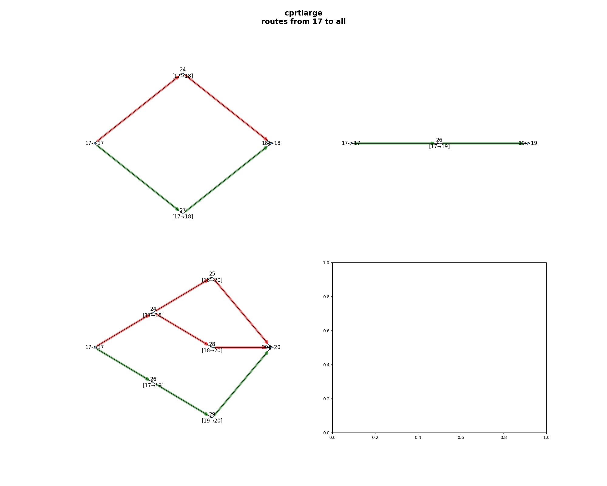

# Suite of tools to help with DTN Contact Plan stuff

Contact plans are the standard method of routing in scheduled space DTN networks. See [this tutorial](https://www.sciencedirect.com/science/article/abs/pii/S1084804520303489) for more information.

These scripts were designed to interface with [HDTN](https://github.com/nasa/HDTN) contact plans. These scripts are not fully tested.

## Contact Graph Visualizer
Contact plans can be hard to reason about due to contacts involving links between nodes that vary based on time.
This [tool](https://bitbucket.org/juanfraire/pycgr/src) uses pyCGR to find routes within a contact plan and creates an output visualization in png format.

### How to use
```bash
# this will generate several files displaying all routes from all nodes to every other node in the contact plan
$ python contact_graph_visualizer.py sample-contact-plans/cprtlarge.json
# this will generate a file displaying all routes from node "1" to node "2"
$ python contact_graph_visualizer.py sample-contact-plans/cprtlarge.json --src 1 --dst 2
# this will generate a file displaying all routes from node "1" to every other node in the contact plan
$ python contact_graph_visualizer.py sample-contact-plans/cprtlarge.json --src 1
# this will generate a file displaying all routes all nodes in the contact plan to node "20"
$ python contact_graph_visualizer.py sample-contact-plans/cprtlarge.json --dst 20
# this will generate a file displaying all routes from node "A" to node "E" in the sample contact plan from https://www.sciencedirect.com/science/article/abs/pii/S1084804520303489
$ python contact_graph_visualizer.py sample-contact-plans/juanfraire_cgr_tutorial.json --src "A" --dst "E"
```




## Contact Plan File Tools
This tool is able to convert between HDTN contact plans in JSON and CSV format. A CSV formatted contact plan can be easier to browse and edit than a JSON file.

Also includes a tool to verify a contact plan's validity to check for any possible mistakes.

### How to use
```bash
# This will determine there are no issues with this contact plan
$ python cp_file_tools.py sample-contact-plans/cprtlarge.json --verify
Verifying contact plan...
Found no issues with contact plan
# This will determine there are issues with this contact plan
$ python cp_file_tools.py sample-contact-plans/badContactPlan.json --verify
Verifying contact plan...
        Error: (Contact id=3) startTime is greater than endTime: (121 > 120)
        Error: Duplicate contact id exists! (id=3)
        Error: Duplicate contact id exists! (id=7)
Issues found with contact plan:
         num errors=3
         num warnings=0
# Given a json file, --j2c will generate a csv file
$ python cp_file_tools.py sample-contact-plans/cprtlarge.json --j2c     
Finished generating csv file, located at ./out/cprtlarge.csv
# Given a csv file, --c2j will generate a nicely indented JSON file
$ python cp_file_tools.py out/cprtlarge.csv --c2j     
Finished generating json file, located at ./out/cprtlarge.json
```